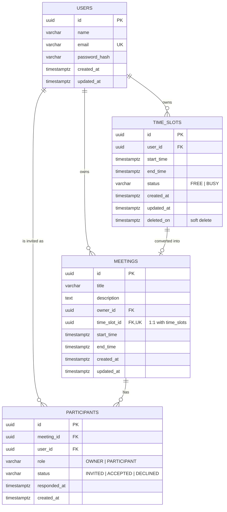
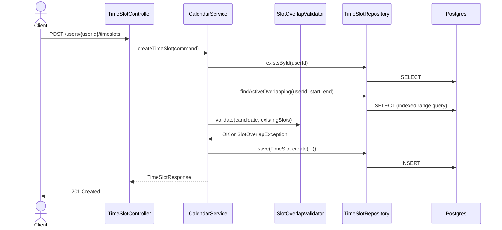
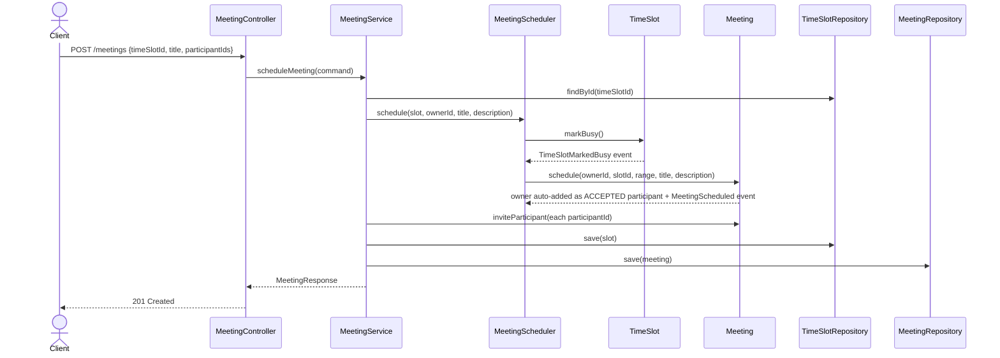
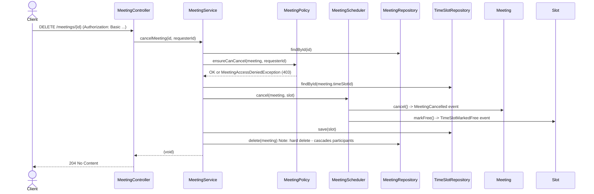
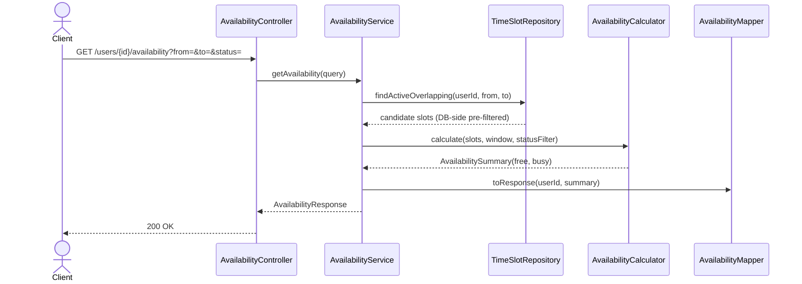
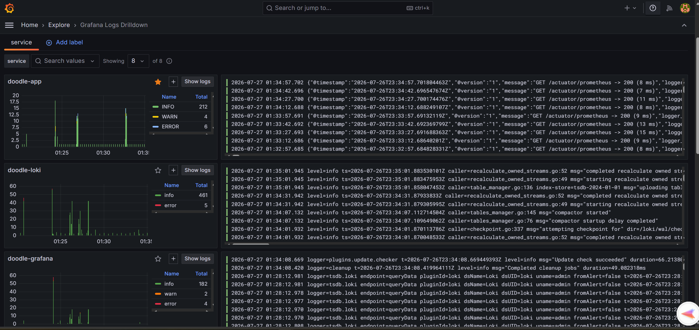
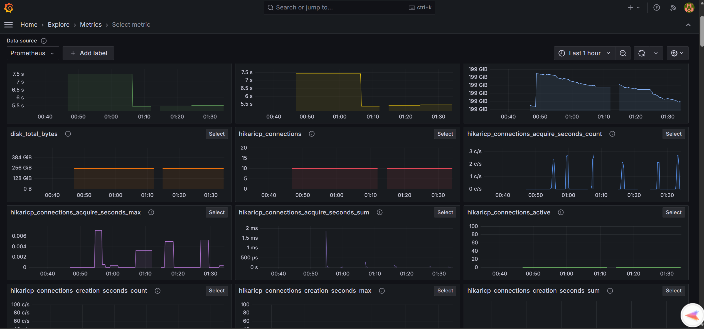

# Metr - Meeting Scheduler (A mini doodle backend design challenge)

> A production-ready implementation of a high-performance meeting scheduling service inspired by Doodle, built with  **Java 21** ,  **Spring Boot** ,  **PostgreSQL** , and modern cloud-native engineering practices.

---

# Overview

This project implements a simplified version of a meeting scheduling platform similar to Doodle.

The objective of this implementation is **not** to recreate the complete Doodle platform, but rather to demonstrate backend engineering principles including:

* Clean Architecture
* Domain Driven Design (DDD)
* SOLID Principles
* RESTful API Design
* Scalability
* Observability
* Production Readiness
* Testing
* Dockerized Deployment

The implementation follows the requirements provided in the assignment while making deliberate architectural decisions aimed at maintainability, extensibility, and performance.

---

# Technology Stack

| Category            | Technology                        |
| ------------------- | --------------------------------- |
| Language            | Java 21                           |
| Framework           | Spring Boot 3.5.x                 |
| Build Tool          | Maven                             |
| Database            | PostgreSQL                        |
| ORM                 | Spring Data JPA / Hibernate       |
| Migration           | Flyway                            |
| Documentation       | OpenAPI 3 / Swagger               |
| Validation          | Jakarta Validation                |
| Security            | Spring Security + JWT (Stateless) |
| Testing             | JUnit 5, Mockito, Testcontainers  |
| Metrics             | Micrometer                        |
| Monitoring          | Prometheus                        |
| Visualization       | Grafana                           |
| Distributed Tracing | OpenTelemetry + Tempo             |
| Logging             | Loki + Promtail                   |
| Health Monitoring   | Spring Boot Actuator              |
| Deployment          | Docker Compose                    |

---

# Design Goals

This implementation was designed with the following goals:

* Maintainable codebase
* Simple but expressive domain model
* Separation of concerns
* High cohesion
* Low coupling
* Production-ready observability
* Efficient database access
* Good API design
* Strong validation
* Comprehensive testing

---

## Table of contents

- [Quick start](#quick-start)
- [Future improvements](#future-improvements)
- [Architecture](#architecture)
- [Domain model &amp; business rules](#domain-model--business-rules)
- [Entity-relationship diagram](#entity-relationship-diagram)
- [Sequence diagrams](#sequence-diagrams)
- [API reference](#api-reference)
- [Authentication](#authentication)
- [Running locally](#running-locally)
- [Observability](#observability)
- [Testing](#testing)
  - [Postman collection](#postman-collection)
- [Design decisions &amp; assumptions](#design-decisions--assumptions)
- [Explicitly out of scope](#explicitly-out-of-scope)
- [Project structure](#project-structure)

---

## Quick start

```bash
docker compose up --build
```

Then:

| What                | Where                                       |
| ------------------- | ------------------------------------------- |
| Metr API           | http://localhost:8088                       |
| Swagger UI          | http://localhost:8088/swagger-ui/index.html |
| Health              | http://localhost:8088/actuator/health       |
| Grafana             | http://localhost:3000  (admin / admin)      |
| Prometheus          | http://localhost:9090                       |
| Tempo (via Grafana) | http://localhost:3200                       |
| Loki (via Grafana)  | http://localhost:3100                       |

The API listens on **container port 8080**, mapped to **host port 8088** (chosen to
avoid clashing with anything already using 8080 locally). See
[Running locally](#running-locally) for the full request walkthrough (register →
create slot → schedule meeting → cancel).

---
## Future improvements

Given more time, roughly in priority order:

1. **JWT-based authentication**, replacing the current HTTP Basic baseline. Basic
   re-verifies the password via `UserRepository.findByEmail` + a BCrypt check on
   *every single request* and sends the raw password on every call; a JWT would be
   issued once (via a `POST /auth/login`-style endpoint; the only place
   `findByEmail` would still run) and subsequent requests would carry a signed,
   time-limited token that's verified by signature/expiry alone, **no
   `UserRepository.findByEmail` call, and no DB hit at all, on the other 99% of
   requests**. Would need a token-revocation/refresh story alongside it (a stateless
   JWT can't be revoked before it expires).
2. **Kafka-based event notifications**, decoupling "something happened" from "who
   needs to know." The domain already publishes exactly the right events for this
   (`ParticipantAcceptedInvitation`, `ParticipantDeclinedInvitation`,
   `MeetingScheduled`, `MeetingUpdated`, `MeetingCancelled`, see the
   [domain event catalogue](#domain-event-catalogue)); today they're only used to
   drive `AbstractAggregateRoot`'s in-process publishing. Producing them onto Kafka
   topics would let independent consumers handle, without coupling this API to any of
   it directly:
   - **Notifying the meeting organiser** as soon as a participant accepts or declines,
     instead of the organiser having to poll `GET /meetings/{id}`.
   - **Orchestrating the rest of the scheduling workflow** as a saga/process manager
     consuming these events e.g. only proceeding once all invited participants have
     responded, or auto-cancelling if a quorum declines.
   - **Emailing the organiser and participants** on scheduling/update/cancellation, and
     handing each recipient a calendar file (`.ics`) so the meeting can be added to
     their individual calendar app in one click, matching real Doodle/Calendly-style
     behavior.
3. **Rate limiting** on `/users` (the one public endpoint) to blunt
   credential-stuffing / registration-spam.
4. **Idempotency keys** on `POST /meetings` to make retried requests safe.
5. **Recurring availability** (e.g. "every weekday 9–5") as a template that generates
   concrete `TimeSlot`s, rather than a real-time recurrence engine.
6. **Multi-tenancy** if this ever needs to serve more than one organization.
7. A populated Grafana alerting rule (e.g. p99 latency, 5xx rate) rather than just the
   dashboard; deliberately left as a dashboard-only demo for now.

---

## Architecture

A flat, conventional Spring Boot layered structure; one package per technical
concern, directly under `com.doodle.challenge`:

```
com.doodle.challenge
├── DoodleApplication.java    application entry point (@SpringBootApplication)
├── controller                thin REST controllers, one per resource. No business logic
├── service                   all business logic; owns transaction boundaries
├── repository                Spring Data JPA repositories; persistence only
├── entity                    JPA entities/value objects/enums (User, TimeSlot, Meeting, Participant, ...)
├── dto                       request/response records + internal command/query records
├── mapper                    entity ↔ DTO conversion
├── exception                 GlobalExceptionHandler + domain exception hierarchy
├── security                  HTTP Basic auth provider/entry point/MDC filter, SecurityConfig
├── validator                 business-rule validators (SlotOverlapValidator, MeetingPolicy)
├── event                     domain events (published on aggregate save)
└── config                    @Bean wiring: OpenAPI, transactions, health indicators, request logging
```

Dependencies flow in one direction only (verified by auditing every cross-package with no import cycles):

```
controller → service → { validator, mapper, repository, security } → { entity, dto } → { event, exception }
```

### Domain event catalogue

`UserCreated` · `TimeSlotCreated/Updated/Deleted/MarkedBusy/MarkedFree` ·
`MeetingScheduled/Updated/Cancelled` ·
`ParticipantInvited/AcceptedInvitation/DeclinedInvitation`

---

## Domain model & business rules

| Rule                                                                                                  | Enforced by                                                                                                        |
| ----------------------------------------------------------------------------------------------------- | ------------------------------------------------------------------------------------------------------------------ |
| A user's slots may not overlap                                                                        | `SlotOverlapValidator`, checked against a DB query pre-filtered to the candidate window                          |
| A meeting can only be scheduled from a**FREE** slot                                             | `TimeSlot.markBusy()` guard, invoked by `MeetingScheduler`                                                     |
| Scheduling a meeting marks its slot**BUSY**; cancelling a meeting marks it **FREE** again | `MeetingScheduler` (coordinates both aggregates in one transaction)                                              |
| A slot backing an active meeting cannot be deleted, or manually marked FREE                           | `TimeSlot.delete()` / `CalendarService.changeSlotStatus()`                                                     |
| Start time must be before end time                                                                    | `TimeRange.of(...)`; the only way to construct a range                                                         |
| A user cannot be invited to the same meeting twice                                                    | `Meeting.inviteParticipant()`, backed by a DB unique constraint on `(meeting_id, user_id)` as defense in depth |
| Only a meeting's owner may update its details, cancel it, or manage participants                      | `MeetingPolicy` *(an inferred rule, see [assumptions](#design-decisions--assumptions))*                       |
| A user may only accept/decline**their own** invitation                                          | `ParticipantService.respondToInvitation()`, checked against the authenticated caller id                          |
| Time slots are soft-deleted (`deleted_on`), never physically removed                                | `TimeSlot.delete()`                                                                                              |

---

## Entity-relationship diagram



**Indexes worth calling out** (see migration files `V1`–`V4` migrations for the full DDL):
`time_slots(user_id, start_time, end_time)` (composite: backs overlap checks and
availability queries without a full scan), a unique index on
`meetings(time_slot_id)` (a slot backs at most one meeting), and a unique index on
`participants(meeting_id, user_id)` (also the DB-level backstop for "no duplicate
invitations").

---

## Sequence diagrams

### Create a time slot



### Schedule a meeting



### Cancel a meeting



### Query availability



---

## API reference

Full interactive docs (with request/response examples) are at
`/swagger-ui/index.html`. Summary:

| Method | Path                                                   | Auth              | Notes                                                                                                                  |
| ------ | ------------------------------------------------------ | ----------------- | ---------------------------------------------------------------------------------------------------------------------- |
| POST   | `/users`                                             | public            | registration: the one deliberate addition to the spec's permit-list, see[assumptions](#design-decisions--assumptions) |
| GET    | `/users/{id}`                                        | basic             |                                                                                                                        |
| POST   | `/users/{userId}/timeslots`                          | basic             |                                                                                                                        |
| GET    | `/users/{userId}/timeslots`                          | basic             | non-deleted slots, sorted;**paginated** (`page`, `size`)                                                     |
| PATCH  | `/timeslots/{id}`                                    | basic             | reschedule; only while FREE                                                                                            |
| DELETE | `/timeslots/{id}`                                    | basic             | rejected (409) if a meeting is backed by it                                                                            |
| PATCH  | `/timeslots/{id}/status`                             | basic             | manual FREE/BUSY toggle, independent of meetings                                                                       |
| GET    | `/users/{userId}/availability`                       | basic             | query params:`from`, `to`, `status` (optional)                                                                   |
| POST   | `/meetings`                                          | basic             | converts a FREE slot; optional initial`participantIds`                                                               |
| GET    | `/meetings/{id}`                                     | basic             |                                                                                                                        |
| GET    | `/users/{userId}/meetings`                           | basic             | meetings owned**or** participated in; **paginated** (`page`, `size`)                                   |
| PATCH  | `/meetings/{id}`                                     | basic, owner only |                                                                                                                        |
| DELETE | `/meetings/{id}`                                     | basic, owner only | cancels; frees the slot                                                                                                |
| POST   | `/meetings/{meetingId}/participants`                 | basic, owner only |                                                                                                                        |
| DELETE | `/meetings/{meetingId}/participants/{userId}`        | basic, owner only |                                                                                                                        |
| PATCH  | `/meetings/{meetingId}/participants/{userId}/status` | basic, self only  | ACCEPTED or DECLINED                                                                                                   |

**Pagination**: `GET /users/{id}/timeslots` and `GET /users/{id}/meetings` accept
`page` (zero-based, default `0`) and `size` (default `20`, capped at `100` -
oversized requests are silently clamped, not rejected) query params, and respond with
a common envelope rather than a bare array:

```json
{ "content": [ /* ... */ ], "page": 0, "size": 20, "totalElements": 42, "totalPages": 3 }
```

Both endpoints are always sorted by start time ascending; there's no client-controlled
`sort` param, so callers never need to know the underlying JPA property names (the
time range is an embedded value object, not a top-level column). The meetings query in
particular is a single DB-level query (`MeetingRepository.findDistinctByOwnerIdOrParticipantsUserIdOrderByRangeStartAsc`)
rather than fetching owned + participated meetings separately and deduplicating in
memory that older approach can't be paginated correctly, since `LIMIT`/`OFFSET`
applied before an in-memory dedup can drop or duplicate rows near a page boundary.

Errors are uniform RFC 7807 `application/problem+json`:

```json
{ "type": "about:blank", "title": "Conflict", "status": 409, "detail": "..." }
```

| Status | When                                                                       |
| ------ | -------------------------------------------------------------------------- |
| 400    | malformed JSON, Bean Validation failure, bad request-level argument        |
| 401    | missing/malformed/incorrect`Authorization: Basic` credentials            |
| 403    | authenticated, but not the meeting owner / not your own invitation         |
| 404    | user, slot, meeting, or participant not found                              |
| 409    | overlapping slot, slot not free, slot has a meeting, duplicate participant |
| 422    | semantically invalid input the domain rejects (e.g. start ≥ end)          |
| 503    | transient DB failure (e.g. connection pool exhausted), safe to retry     |
| 504    | a query or transaction exceeded its configured timeout                     |
| 500    | anything unexpected (logged server-side, generic message to the client)    |

---

## Authentication

Stateless **HTTP Basic**, no login endpoint, no server-side session:

1. Register via `POST /users` (public, see [assumptions](#design-decisions--assumptions)).
2. Send `Authorization: Basic <base64(email:password)>` on every subsequent request.
3. `BasicAuthenticationProvider` calls `UserRepository.findByEmail` and checks the raw
   password against the stored BCrypt hash **on every request**; there is no token,
   so nothing to sign, expire, or refresh, but also no way to authenticate without a
   DB round trip each time. On success it re-authenticates with the user's id (a
   `UUID`) as the principal, so the rest of the app is unaffected by the auth
   mechanism swap: owner-only endpoints still read the caller's id via
   `@AuthenticationPrincipal UUID`, exactly as before.

> **Note:** `UserRepository.findByEmail` is currently the single hottest query in the application; it runs on *every authenticated request*, not just at login, because
> HTTP Basic has no concept of a pre-verified session. Adopting JWT (see
> [Future improvements](#future-improvements)) would remove this per-request DB
> dependency entirely: a signed token proves identity by signature/expiry alone, so`findByEmail` would only run once, at the token-issuing `/auth/login` call, instead of on every single request.

This is intentionally the simplest correct baseline, not the final word, see:  [Future improvements](#future-improvements) for why a JWT-based scheme is the natural next step.

---

## Running locally

### With Docker Compose (recommended)

```bash
docker compose up --build
```

Brings up Postgres, the app, and the full observability stack (see below). First run downloads several images and can take a couple of minutes; subsequent runs are fast.

Full request walkthrough:

```bash
BASE=http://localhost:8088
CREDS="ada@example.com:correct-horse-battery"

# Register (public), every other call below sends CREDS as Basic auth instead of a token
USER_ID=$(curl -s -X POST $BASE/users -H "Content-Type: application/json" \
  -d '{"name":"Ada Lovelace","email":"ada@example.com","password":"correct-horse-battery"}' | jq -r .id)

# Create a slot, schedule a meeting, check availability, cancel
SLOT_ID=$(curl -s -X POST $BASE/users/$USER_ID/timeslots -u "$CREDS" \
  -H "Content-Type: application/json" \
  -d '{"startTime":"2026-09-01T09:00:00Z","endTime":"2026-09-01T09:30:00Z"}' | jq -r .id)

curl -s $BASE/users/$USER_ID/availability -u "$CREDS" \
  --get --data-urlencode from=2026-09-01T00:00:00Z --data-urlencode to=2026-09-02T00:00:00Z

MEETING_ID=$(curl -s -X POST $BASE/meetings -u "$CREDS" \
  -H "Content-Type: application/json" \
  -d "{\"timeSlotId\":\"$SLOT_ID\",\"title\":\"Sprint planning\"}" | jq -r .id)

curl -s -X DELETE $BASE/meetings/$MEETING_ID -u "$CREDS" -w "%{http_code}\n"
```

### Without Docker (app only, against your own Postgres)

```bash
mvn spring-boot:run
```

`application.yml`'s datasource/port defaults are meant for exactly this; point them
at whatever local Postgres you already have running. Flyway will create the schema on
first startup.

### Tearing down

```bash
docker compose down          # stop + remove containers
docker compose down -v       # also remove named volumes (Postgres data, Grafana state, etc.)
```

---

## Observability

Logs:

Metrics:



| Signal               | Path                                                                                                                                                                          |
| -------------------- | ----------------------------------------------------------------------------------------------------------------------------------------------------------------------------- |
| **Metrics**    | App exposes Prometheus-format metrics at`/actuator/prometheus` (public, see [assumptions](#design-decisions--assumptions)); Prometheus scrapes it every 15s                |
| **Traces**     | Micrometer Tracing (OTel bridge) → OTLP →`otel-collector` → `tempo`; 100% sampling for this demo                                                                       |
| **Logs**       | Structured JSON to stdout (Spring Boot's native`logging.structured.format.console: logstash`) → Docker's log driver → `promtail` (Docker service discovery) → `loki` |
| **Dashboards** | Grafana auto-provisions all 3 datasources (with**trace-to-logs** linking configured) plus one starter dashboard, "Doodle Challenge - Overview"                          |
| **Health**     | `/actuator/health` (public), `/actuator/health/readiness`, `/actuator/health/liveness`                                                                                  |

Every structured log line carries `traceId`/`spanId` (automatic, via Micrometer
Tracing's MDC integration) plus `userId` (added by `UserIdMdcFilter`, once
`BasicAuthenticationProvider` has authenticated the request) and `durationMs` (added
by `RequestLoggingFilter`), so a slow or failing request found in
Grafana's Explore view can be traced from a log line straight to its full span tree in
Tempo, or filtered by user.

**Health indicators**: `db` and `diskSpace` are Spring Boot Actuator's built-ins
(verified working, not reimplemented); `flyway` is a **custom** indicator this project
adds (`config.FlywayHealthIndicator`), since Actuator ships a
`/flyway` migration-listing endpoint but no pass/fail health signal. The app was verified to report **DOWN** (`503`, with clean per-component detail) when Postgres is stopped, and to recover automatically once it's back, see [Testing](#testing) for how a real bug in the first version of that indicator (an uncaught exception crashing the *whole* health endpoint instead of marking one component down) was caught and fixed.

Dashboard queries assume `job="doodle-challenge"` (set in `prometheus.yml`) and the `http.server.requests` percentile histogram (enabled in `application.yml`).

---

## Testing

```bash
mvn test
```

All tests passes. Also, Testcontainers-backed tests need Docker running locally.

### Postman collection

Alongside the JUnit suite above, `postman/` contains a full scenario-coverage Postman collection that exercises the **running** API end-to-end over real HTTP; 68 requests
across 7 folders, covering the golden path *and* the error scenarios (conflicts, validation failures, ownership/authorization checks, not-found, the RFC 7807 error shape) for every endpoint in [API reference](#api-reference).

**Import**

1. Start the app: `docker compose up --build`, or `mvn spring-boot:run` (see [Running locally](#running-locally)).
2. In Postman: **File → Import**, and select both files from `postman/`:
   - `Doodle-Meeting-Scheduler.postman_collection.json`
   - `Doodle-Local.postman_environment.json`
3. Pick the **"Doodle - Local"** environment in the top-right environment selector.
   Its `baseUrl` defaults to `http://localhost:8080` (plain `mvn spring-boot:run`); if you're running via `docker compose` instead, edit the environment's `baseUrl` to
   `http://localhost:8088`.
4. Run the whole collection top-to-bottom with the **Collection Runner**. Folders 01–07 are ordered as one continuous story; register users, build a calendar, schedule a meeting, exercise participants/availability against it, then cancel it last, so IDs and timestamps chain forward via collection variables. Individual requests can also be run standalone once that chain has executed at least once in the session.

Re-running the full collection from scratch is safe: user emails are randomized per run (`{{$randomUUID}}`), so registration never collides with a previous run's data.

**Auto-running with Newman (CLI / CI)**

`postman/run-newman.sh` automates the whole thing for a scripted or CI environment: it polls `/actuator/health` until the app answers (so it doesn't race a just-started container), then runs the collection via `npx newman` (no global install needed) and exits with Newman's own exit code: **non-zero if any assertion fails**, making it a drop-in pass/fail gate.

```bash
# 1. Start the app in the background
docker compose up -d --build postgres app     # or: mvn spring-boot:run &

# 2. Wait for health, then run the full collection
BASE_URL=http://localhost:8088 ./postman/run-newman.sh   # 8080 if run via mvn instead

# 3. Tear down
docker compose down
```

Environment variables the script reads:

| Variable            | Default                   | Purpose                                                         |
| ------------------- | ------------------------- | --------------------------------------------------------------- |
| `BASE_URL`        | `http://localhost:8080` | API base URL, forwarded to the collection's`baseUrl` variable |
| `TIMEOUT_SECONDS` | `60`                    | How long to wait for`/actuator/health` before giving up       |

Any extra arguments are passed straight through to `newman run`, e.g. for a machine-readable report a CI pipeline can publish:

```bash
./postman/run-newman.sh --reporters cli,junit --reporter-junit-export postman/newman-report.xml
```

A minimal GitHub Actions job doing the same thing end-to-end:

```yaml
- name: API scenario tests (Postman/Newman)
  run: |
    docker compose up -d --build postgres app
    BASE_URL=http://localhost:8088 ./postman/run-newman.sh --reporters cli,junit \
      --reporter-junit-export postman/newman-report.xml
    docker compose down
```

Calling Newman directly (no wait-for-health, no script) also works if the app is already known to be up:

```bash
npx newman run postman/Doodle-Meeting-Scheduler.postman_collection.json \
  --env-var baseUrl=http://localhost:8080
```

**Coverage**

| Folder                    | Focus                                                                                                    |
| ------------------------- | -------------------------------------------------------------------------------------------------------- |
| 01 - Users                | Registration, validation errors, duplicate email, lookup, 401s                                           |
| 02 - Time Slots           | Create/overlap/partial-overlap, pagination + size cap, reschedule, manual FREE/BUSY toggle, delete rules |
| 03 - Meetings             | Scheduling, slot-not-free/not-found conflicts, owner-only update                                         |
| 04 - Participants         | Invite/duplicate/forbidden, self-only response, remove                                                   |
| 05 - Availability         | FREE/BUSY filtering, invalid range (422), missing query params                                           |
| 06 - Meeting Cancellation | Owner-only cancel, hard-delete verification, slot freed afterward                                        |
| 07 - Auth & Authorization | Public permit-list vs. protected endpoints, malformed credentials                                        |

Every error-path request asserts the RFC 7807 `ProblemDetail` shape described in [API reference](#api-reference), not just the status code.

## Design decisions & assumptions

- **`password_hash` added to `users`.** The original schema didn't include it; Basic
  auth needs *something* to verify against on every request, and hardcoded demo
  credentials felt less representative of real design work than a proper (BCrypt)
  column.
- **No `Calendar` table.** Per the brief: a user's calendar is simply their set of
  `TimeSlot` rows, queried by `user_id`; a real DB table would be redundant state.
- **Cancelling a meeting hard-deletes it.** The given schema has no soft-delete column
  on `meetings` (unlike `time_slots`), so cancellation removes the row (cascading to
  its participants) and frees the slot; matching the literal `DELETE /meetings/{id}`
  endpoint rather than introducing an unspecified status column.
- **IDs are UUIDs assigned by the domain**, not database sequences; an aggregate has
  a stable identity (and can register a creation event) before it's ever persisted.
- **`POST /users` is public**, added to the permit-list beyond the spec's literal list
  (Swagger, health); otherwise registration would be unreachable (no way to send
  credentials for an account that doesn't exist yet).
- **`/actuator/prometheus` is public.** Prometheus has no mechanism to supply
  per-request Basic credentials. In a real deployment this would be restricted by
  network policy instead of application-level auth; permitting it here is the
  pragmatic equivalent for a local/demo stack.
- **Owner-only meeting policy is an inferred rule**, not explicit in the brief: without
  it, any authenticated user could cancel or edit anyone else's meeting. Encapsulated
  in `MeetingPolicy` so it's a single, explicit, testable rule rather than scattered
  checks.
- **A meeting's owner is auto-added as an ACCEPTED participant** at scheduling time; 
  scheduling is itself an implicit acceptance.
- **A slot can be manually marked FREE/BUSY** (`PATCH /timeslots/{id}/status`)
  independent of any meeting e.g. blocking out personal time, but marking a
  meeting-backed slot FREE directly is rejected, to prevent an inconsistent
  slot/meeting state.
- **Responding to an invitation is restricted to the invited user**, enforced by
  comparing the authenticated caller id against the path's participant id, not just by
  convention.
- **HTTP Basic over JWT, for now.** Basic is the simplest correct way to satisfy "the
  API is authenticated" without inventing token-issuance/verification machinery for a
  scope this size; every request re-proves the password against the stored hash, so
  there's no token to sign, store, expire, or revoke. The tradeoff (`UserRepository.findByEmail` 
  plus a BCrypt check on *every single request*, and the password crossing the wire on
  every call instead of once) is exactly why a JWT-based scheme is called out as the
  top item in [Future improvements](#future-improvements) rather than something this
  project claims to have solved; JWT would confine that DB lookup to the one-time
  login call and verify every subsequent request by signature/expiry alone.
- **No custom mid-request "abort after N seconds" filter.** Considered and rejected: a
  hand-rolled `Future`-based timeout racing against the servlet filter chain risks two
  threads writing the same response once the timeout fires while the original work is
  still in flight, and interrupting a virtual thread doesn't reliably stop a blocking
  JDBC call anyway. Since nearly all request work here is a DB call, the JPA query
  timeout and transaction timeout (enforced at the layer that can actually cancel the
  work, the JDBC driver honoring `setQueryTimeout`) bound total request time instead.

---

## Explicitly out of scope

Intentionally omitted as outside this assignment's scope (not partially built, not
planned as immediate next steps unless listed under
[Future improvements](#future-improvements)):

Google/Outlook/Apple Calendar integration · poll voting · scheduling assistant / AI
scheduling · recurring meetings or availability · timezone conversion (all timestamps
are UTC `Instant`s) · meeting rooms · attachments · email/push notifications ·
reminder jobs · team workspaces · calendar sharing · search · audit history ·
multi-tenancy.

---

## Project structure

```
Doodle.com/
├── pom.xml                          Maven build: Java 21, Spring Boot 3.5, all dependencies
├── Dockerfile                       builds the app image consumed by docker-compose.yml
├── docker-compose.yml               app + Postgres + full observability stack, one command
├── README.md                        this file
├── observability/                   Prometheus/Grafana/Tempo/Loki/Promtail/OTel config
│   ├── prometheus/prometheus.yml        scrape config (job "doodle-challenge", 15s interval)
│   ├── grafana/provisioning/            datasource + dashboard auto-provisioning
│   ├── grafana/dashboards/              the "Doodle Challenge - Overview" starter dashboard
│   ├── tempo/tempo.yaml                 trace storage/query config
│   ├── loki/loki-config.yaml            log storage/query config
│   ├── promtail/promtail-config.yaml    tails Docker container logs, ships them to Loki
│   └── otel-collector/otel-collector-config.yaml   receives OTLP traces, forwards to Tempo
├── postman/                         scenario-coverage Postman collection (see Testing)
│   ├── Doodle-Meeting-Scheduler.postman_collection.json   68 requests / 7 folders
│   ├── Doodle-Local.postman_environment.json              baseUrl variable for Postman
│   └── run-newman.sh                                       wait-for-health + newman runner (CI-friendly)
└── src/
    ├── main/
    │   ├── java/com/doodle/challenge/
    │   │   ├── DoodleApplication.java   application entry point (@SpringBootApplication)
    │   │   ├── controller/              thin REST controllers, one per resource - no business logic
    │   │   ├── service/                 all business logic; owns transaction boundaries
    │   │   ├── repository/              Spring Data JPA repositories - persistence only
    │   │   ├── entity/                  JPA entities/value objects/enums (User, TimeSlot, Meeting, Participant, ...)
    │   │   ├── dto/                     request/response records + internal command/query records
    │   │   ├── mapper/                  entity ↔ DTO conversion
    │   │   ├── exception/               GlobalExceptionHandler + domain exception hierarchy
    │   │   ├── security/                HTTP Basic auth provider/entry point/MDC filter, SecurityConfig
    │   │   ├── validator/               business-rule validators (SlotOverlapValidator, MeetingPolicy)
    │   │   ├── event/                   domain events (published on aggregate save; see catalogue above)
    │   │   └── config/                  @Bean wiring: OpenAPI, transactions, health indicators, request logging
    │   └── resources/
    │       ├── application.yml          active by default (docker-compose and a plain local run)
    │       ├── application-dev.yml      opt-in via SPRING_PROFILES_ACTIVE=dev - verbose SQL logging
    │       ├── application-test.yml     opt-in via SPRING_PROFILES_ACTIVE=test - not required by the current suite
    │       ├── application-prod.yml     opt-in via SPRING_PROFILES_ACTIVE=prod - tighter logging/actuator exposure
    │       └── db/migration/            V1..V4__*.sql Flyway migrations (schema DDL, in order)
    └── test/java/com/doodle/challenge/  mirrors main one-for-one; 129 tests (see Testing above)
```

Test packages also include one cross-cutting `integration` package for full-stack, multi-layer tests (`BookingFlowIntegrationTest`) that don't belong to any single layer.
